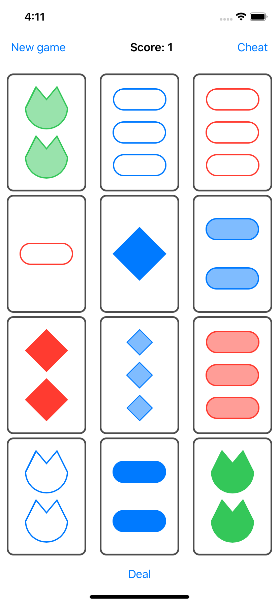

#  SetGame

A SwiftUI [Set](https://en.wikipedia.org/wiki/Set_(card_game)) implementation for Stanford's [CS193p](https://cs193p.sites.stanford.edu) homework assignment 3.

## To Do

- Deselect cards after blinking (what a headache...)
- Properly center score
- Dark mode support
